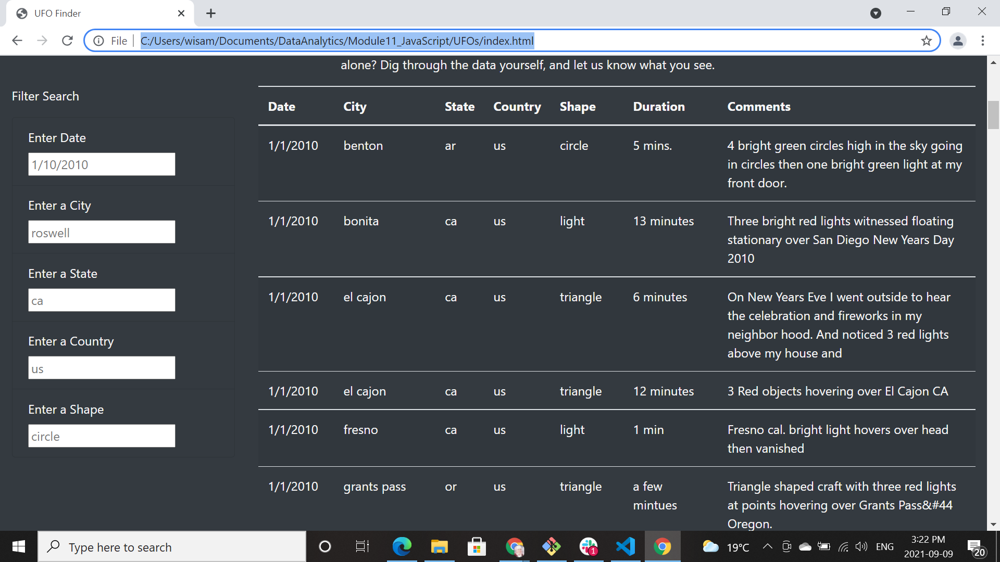
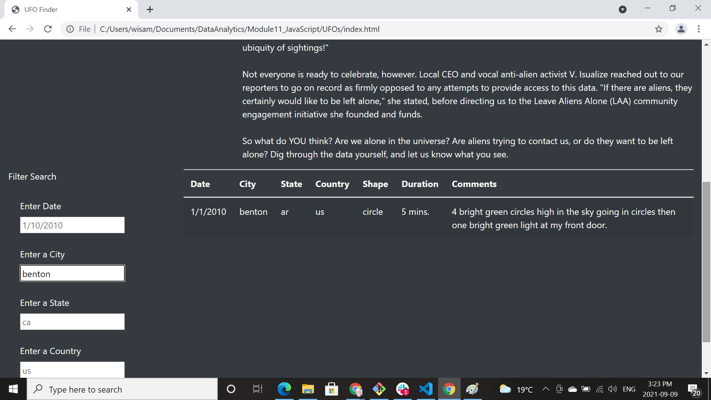

# UFO Sightings with JavaScript
## Overview of Project
This project aims to create a webpage and dynamic table to provide overview about UFO sightings. A more in-depth analysis of UFO sightings is added by allowing users to filter for multiple criteria at the same time. In addition to the date, users can filter by the city, state, country, and shape.

## Results
The new webpage allows users to select one or more criteria to refine UFO sightings results, users can filter by any combination of city, state, country, and shape:

For example, filtering results by city named "benton" shows one UFO sighting as per the below picture:

## Summary
The webpage achieved its intended functionality and users can get in-depth information about UFOs. However, there is one drawback for this page. The filters do not contain a drop down list which means users should know beforehand what they are looking for and it should match the data stored in the data.js file. for example, they should know the abbreviation for states, they would not find any result if they iput the full name of the state.

Therefore, here are two additional recommendations for further development on this webpage:
1. Improve input functionality in search criteria by adding dropdown menu for each criteria
2. Add a reset button to clear search criteria
